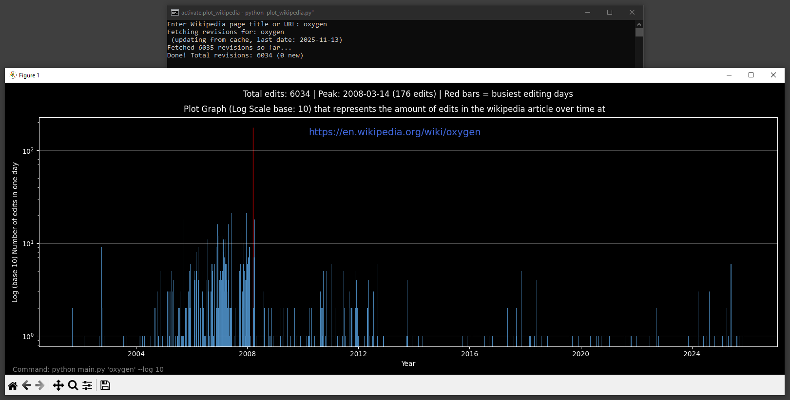

<!-- ZS:COMPLEXITY:MEDIUM -->
<!-- ZS:PLATFORM:DESKTOP -->
<!-- ZS:LANGUAGE:PYTHON -->
<!-- TINS Specification v1.0 -->

# TINS Wikipedia Edit History Plotter

## Description

A command-line tool that fetches Wikipedia page revision history and generates a logarithmic plot showing edit activity over time by day. It features intelligent caching to avoid re-fetching data on subsequent runs, dark mode visualization, and the ability to display the Wikipedia link directly in the plot. The tool accepts Wikipedia page titles or URLs and supports customizable logarithmic scale bases for better visualization of edit patterns.

This tool is designed for researchers, Wikipedia contributors, and data analysts who want to visualize and understand edit patterns on Wikipedia pages. It provides insights into content evolution and collaborative editing activity.

## Functionality

### Core Features

- Fetch complete revision history from Wikipedia API (handles pagination correctly)
- Intelligent caching system that only downloads new revisions since last run
- Generate bar charts with logarithmic y-axis showing daily edit counts
- Highlight busy editing days (top 40% of edit days) in red
- Display peak editing day with date and count
- Include the Wikipedia page link in blue within the plot title
- Show the command used to generate the plot in the footer
- Support both interactive input and command-line arguments
- Handle Wikipedia URLs or plain page titles as input

### User Interface

The tool is primarily CLI-based with visual output through matplotlib plots. When no arguments are provided, it prompts for input:

```
$ python main.py
Enter Wikipedia page title or URL: Oxygen
Fetching revisions for: Oxygen
Fetched 6034 revisions so far...
Done! Total revisions: 6034 (6034 new)
```

The generated plot displays:

```
Plot Graph (Log Scale base: 10) that represents the amount of edits in the wikipedia article over time at
https://en.wikipedia.org/wiki/Oxygen
________________________________________________________________________

[Bar chart with logarithmic y-axis showing daily edit counts over time]
________________________________________________________________________

Total edits: 6034 | Peak: 2019-02-15 (45 edits) | Red bars = busiest editing days
Command: python main.py 'Oxygen' --log 10
```

### Command Line Usage

The script supports the following CLI patterns:

- Interactive: `python main.py` (prompts for input)
- Page title: `python main.py Oxygen`
- URL: `python main.py https://en.wikipedia.org/wiki/Oxygen`
- Custom log base: `python main.py Oxygen --log 2`

### Edge Cases

- Invalid page titles: Display "Error: Page not found or invalid response"
- Network errors: Handle gracefully with appropriate error messages
- Empty or non-existent pages: Alert user that the page doesn't exist
- Special characters in titles: Sanitized for cache filenames
- Very old pages with many edits: Efficient pagination handling
- Cached data for unchanged pages: Skip fetching when no new revisions

## Technical Implementation

### Architecture

The application follows a modular structure with separate concerns:

- Data fetching and caching layer
- Plot generation and visualization layer
- CLI argument parsing and main execution flow

It uses a local file-based cache to store revision date lists in JSON format, allowing incremental updates without re-downloading historical data.

### Data Structures

Revision data is stored as simple date strings:

```python
# Final processed data structure
dates = [
    "2024-01-01",
    "2024-01-01",
    "2024-01-02",
    # ... more YYYY-MM-DD formatted dates
]
```

Cache files are named to resemble the full Wikipedia URL structure for better organization:

```python
# Cache file naming based on Wikipedia URL
def get_cache_filename(title):
    # Construct Wikipedia URL from title
    wiki_url = f'https://en.wikipedia.org/wiki/{title.replace(" ", "_")}'
    # Make filename resemble the link structure using dashes as separator
    safe_url = wiki_url.replace('https://', 'https-').replace('/', '-').replace(':', '-').replace('.', '-').replace('?', '-').replace('"', '-').replace('<', '-').replace('>', '-').replace('|', '-')
    return os.path.join('cache', f"{safe_url}.json")
```

### Algorithms

**Caching Strategy:**
```python
# Load cached dates if available
cached_dates = load_cached_dates(title)
dates = cached_dates[:]

# If cache exists, set rvstart to continue from latest revision
if cached_dates:
    last_date = cached_dates[-1]
    params["rvstart"] = last_date + "T00:00:00Z"
```

**Revision Fetching:**
```python
# Fetch revisions in batches of 500 using pagination
while True:
    response = requests.get(url, params=params, headers=headers)
    revisions = response.json()["query"]["pages"][page_id]["revisions"]

    for rev in revisions:
        # Extract date part only
        date = rev["timestamp"][:10]
        fetched_dates.append(date)

    # Continue if more data available
    if "continue" in response:
        params["continue"] = response["continue"]["continue"]
        params["rvcontinue"] = response["continue"]["rvcontinue"]
    else:
        break
```

**Visualization:**
```python
# Count edits per day
daily_counts = Counter(dates)

# Sort dates and prepare for matplotlib
sorted_dates = sorted(daily_counts.keys())
counts = [daily_counts[date] for date in sorted_dates]
date_objects = [datetime.strptime(d, "%Y-%m-%d") for d in sorted_dates]
date_nums = mdates.date2num(date_objects)

# Create bars with logarithmic scale
plt.figure(figsize=(16, 6))
plt.yscale('log', base=log_base)
bars = plt.bar(date_nums, counts, width=1.0, color='steelblue', edgecolor='none', align='center')
```

## Installation Instructions

### Prerequisites

- Python 3.6 or higher
- Internet connection for Wikipedia API access

### Installation Steps

1. Clone or download the project files
2. Create a virtual environment (recommended):
   ```bash
   python -m venv venv
   venv\Scripts\activate  # On Windows
   # or
   source venv/bin/activate  # On Unix/macOS
   ```

3. Install dependencies:
   ```bash
   pip install -r requirements.txt
   ```

4. Run the tool:
   ```bash
   python plot_wikipedia.py [page_title_or_url] [--log base]
   ```

### Example Usage

```bash
# Interactive mode
python plot_wikipedia.py

# Direct page title
python plot_wikipedia.py Oxygen

# Wikipedia URL
python plot_wikipedia.py https://en.wikipedia.org/wiki/Oxygen

# Custom log base
python plot_wikipedia.py Oxygen --log 2
```

## Testing Scenarios

### Basic Functionality
- [ ] Script accepts page title "Python" and generates plot
- [ ] Script accepts full URL and extracts title correctly
- [ ] Network timeout is handled gracefully
- [ ] Invalid page titles show appropriate error message

### Caching Behavior
- [ ] First run: Fetches all revisions and caches them
- [ ] Subsequent run: Only fetches revisions newer than cached max date
- [ ] Cache files created in 'cache/' directory
- [ ] Cache files use sanitized filenames for special characters

### Visualization
- [ ] Plot shows logarithmic scale (verify labels show "Log (base X)")
- [ ] Red bars highlight busy editing days (top 40% of max edits)
- [ ] Peak date is correctly identified and displayed
- [ ] Page link appears in blue in the title area
- [ ] Command used appears in gray footer

### CLI Arguments
- [ ] --log parameter changes logarithmic base correctly
- [ ] Help message displays correctly with --help
- [ ] Interactive mode works when no arguments provided

## Performance Goals

- Initial data fetch: Under 30 seconds for pages with 6000+ revisions
- Cached updates: Under 5 seconds when new data is minimal
- Plot generation: Under 2 seconds for any dataset size
- Memory usage: Under 100MB for large revision datasets

## Security Considerations

- Uses read-only Wikipedia API (public data)
- No user data collection or storage
- Safe file operations with proper error handling
- No external dependencies except trusted libraries (requests, matplotlib)

**Plot Export:** Automatically saves high-quality PNG images to the `plotGraphs/` folder with descriptive filenames for easy sharing and archiving.

## Extended Features (Optional)

- Export plot data to CSV format
- Generate multiple pages simultaneously
- Add date range filteripren- Cache statistics reporting
- Batch processing mode

---

## License
[MIT License](LICENSE)

---

## Acknowledgments
*   Special thanks to ScuffedEpoch for the TINS methodology and the initial example.
*   Thanks to the free tier AI assistant for its initial contribution to the project.
*   Research LLM Cline:x-ai/grok-code-fast-1 (free tier Cline provider)

This project builds upon the foundations of the following projects:
- [TINS Edition](https://ThereIsNoSource.com) - Zero Source Specification platform that enables:
  - Complete application reconstruction from specification
  - Self-documenting architecture through detailed markdown
  - Future-proof design adaptable to advancing LLM capabilities
  - Progressive enhancement support as LLM technology evolves
  - Platform-agnostic implementation guidelines
  - Flexible technology stack selection within specified constraints
  - Comprehensive behavioral specifications for consistent rebuilds
  - Automatic adaptation to newer LLM models and capabilities
